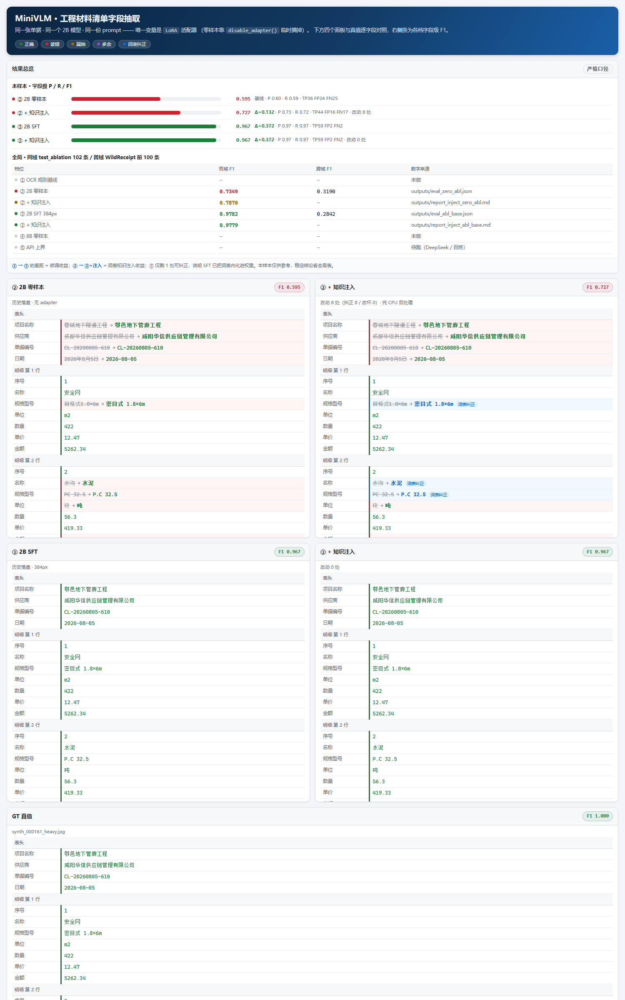

# 图文多模态文档结构化提取系统

面向**工程单据**场景的图文多模态结构化提取，在 **8GB 消费级显卡**上完成
Qwen3-VL-2B 的 QLoRA 微调与 DPO 后训练，并与商用 API 大模型做同口径多档对比。

完整技术复盘见 [`docs/retrospective.md`](docs/retrospective.md)。

---

## 当前进度

- [x] **W1 环境就绪**（含冒烟测试验收）
- [x] 数据管线（schema 设计 → 渲染 → 退化 → GT 生成）
- [x] SFT 微调（v1：600 步 / 58.7 分钟 / 峰值 4.03GB）
- [x] 评测框架（合成三档 / 真实收据零样本 vs 微调后）
- [~] 五档对比表 **4/5** —— ② 2B 零样本 ✓（同域 0.7349 / 跨域 0.319）｜ ③ 2B 微调后 ✓（0.9782 / 0.284）｜ ⑤ 商用 API ✓（`deepseek-flash --no-thinking` 0.9681 / 0.4408）｜ ① 规则基线 ✗ ｜ ④ 8B 零样本 ✗
- [x] 消融实验 + 失败分析（6 档全跑完，含逐配置失败分析报告）
- [x] DPO 后训练（偏好数据 143 对 + 自写 DPO 循环 → **负结果，根因已定位**）
- [x] 知识注入（标准词表 + 保守模糊纠错 → ② 零样本 **+0.0522** 且改坏 0 处；③ SFT 档 ±0）
- [x] **Demo**（`src/demo.py`，Gradio 四栏对照 + 静态预览；29 项 CPU 自检全绿）
- [x] **一页 Results + 项目简介**（[`outputs/results_onepager.md`](outputs/results_onepager.md) · [`outputs/resume_minivlm.md`](outputs/resume_minivlm.md)）
- [x] **DSPy prompt 优化**（`src/optimize_prompt_dspy.py`，跨域 flat 模式）—— 优化成功
  （val F1 0.5205 → **0.7490**，¥0.46）；三组归因对照证明**收益全部来自「补齐缺失字段」**，
  GEPA 的措辞规则为负贡献（跨域 F1：手写 3 字段 0.4408 / **手写 8 字段 0.7085** / GEPA 0.6830）→
  [`outputs/report_dspy_flat.md`](outputs/report_dspy_flat.md)
- [ ] 评测报告 / 技术博客

---

## 环境

**硬件**：RTX 4060 Laptop 8GB · Windows 11 · 驱动 616.92（CUDA UMD 13.4）

**已锁定的版本组合**（改动前请三思，见下方警告）：

| 组件 | 版本 | 组件 | 版本 |
|---|---|---|---|
| Python | 3.12.6 | unsloth | 2026.9.4 |
| torch | **2.14.0+cu130** | triton | 3.8.0 |
| torchvision | 0.29.0+cu130 | bitsandbytes | 0.50.2 |
| transformers | 5.5.0 | trl | 0.24.0 |
| peft | 0.20.0 | datasets | 4.3.0 |
| accelerate | 1.15.0 | dspy | 3.3.1 |
| qwen-vl-utils | 0.0.14 | pillow | 12.3.0 |

> ⚠️ **装包警告**
> PyPI 上 Windows 版 torch 默认是 **CPU 版**。任何可能触发 torch 升级的操作
> （例如 `pip install unsloth`）都必须显式指定官方 CUDA 源，否则 GPU 会失效：
> ```powershell
> pip install <pkg> --index-url https://download.pytorch.org/whl/cu130
> # 已装错时：
> pip install --force-reinstall torch torchvision --index-url https://download.pytorch.org/whl/cu130
> ```

**Windows 平台已知限制**（不影响正确性，仅影响速度）：
- `FA2 = False` —— flash attention 2 不可用，走 eager / xformers
- `torch.compile` 对部分 Qwen3-VL 视觉算子编译失败（InductorError），自动降级 eager

---

## 目录结构

```
MiniVLM/
├── venv-gld/            虚拟环境（勿提交）
├── scripts/             环境与工具脚本
│   ├── check_env.py     环境自检
│   ├── smoke_test.py    冒烟测试（W1 验收）
│   ├── _test_dpo_math.py          DPO 数学 CPU 单测
│   └── _test_evaluate_api.py      API 评测 CPU 单测
│   └── _test_evaluate_args.py     两脚本参数对齐回归（防参数漂移）
│   └── _analyze_fields.py         逐字段拆解两组评测结果（tp/fp/fn/无中生有）
├── src/                 项目源码
│   ├── render.py        合成数据渲染
│   ├── degrade.py       图像退化管线
│   ├── build_dataset.py 数据集构建与划分
│   ├── train_sft.py     SFT 训练
│   ├── run_ablation.py  消融实验调度
│   ├── build_pref_data.py  DPO 偏好数据构造（断点续跑）
│   ├── train_dpo.py     DPO 后训练（自写循环，TRL 不支持 Qwen3-VL）
│   ├── evaluate.py      本地评测（增量落盘 / 断点续跑 / OOM 自动降批）
│   ├── evaluate_api.py  API 上界评测（⑤ 档，口径复用 evaluate.py）
│   ├── analyze_errors.py           失败分析（7 类错误）
│   ├── analyze_error_consistency.py 系统性错误 vs 随机误差判别
│   ├── check_amount_consistency.py  金额等式一致性
│   ├── check_pref_quality.py        偏好数据质量门（chosen 绝对正确率）
│   ├── build_lexicon.py            标准词表构建（train.jsonl 的 GT 值域）
│   ├── check_lexicon_coverage.py   知识注入可行性前置检查（哪些字段可救）
│   ├── inject_knowledge.py         知识注入：词表保守纠错 + 重打分
│   ├── demo.py          Gradio 四栏对照 Demo（含 --check / --smoke / --render-sample）
│   ├── make_charts.py   图表生成（SVG）
│   └── prepare_{xfund,wildreceipt}.py  公开数据集准备
├── data/
│   ├── synthetic/       合成图 + Ground Truth
│   ├── lexicon/         标准词表（v1.json，由 train.jsonl 派生）
│   └── public/          WildReceipt / CORD / FUNSD
├── outputs/             模型 checkpoint、评测结果、图表
├── docs/                方案文档
└── requirements-backup.txt   初始环境快照（回滚用）
```

---

## 快速开始

```powershell
cd C:\MiniVLM

# 1) 环境自检（秒级，不下载模型）
.\venv-gld\Scripts\python.exe scripts\check_env.py

# 2) 冒烟测试（首次需下载模型约 2.2GB）
$env:HF_ENDPOINT = "https://hf-mirror.com"
.\venv-gld\Scripts\python.exe scripts\smoke_test.py
```

---

## 实验结果

### 1. SFT 主结果（合成测试集 n=90 · 同分布）

| 档位 | 字段级 F1 |
|---|---:|
| clean | 0.994 |
| medium | 0.982 |
| heavy | 0.961 |
| **全测试集** | **0.982** |

JSON 合法率 100%；600 步 / 58.7 分钟 / 峰值显存 4.03 GB。

### 2. 跨域泛化（真实英文收据 WildReceipt，n=100）

| 模型 | 字段级 F1 | 幻觉率 |
|---|---:|---:|
| 零样本 | 0.319 | 16.0% |
| SFT 微调后 | 0.284 | 28.0% |

**微调在这个跨语言跨域任务上基本无效，且把幻觉率从 16% 抬到 28%。**
拆开看召回率只掉 9.5%，下降主要来自精度 —— 属于「少量数据微调放大幻觉倾向」，
不是灾难性遗忘。这也正是引入 DPO 的动机 —— 而 DPO 未能解决它（见 §5）。

### 3. 消融实验（同一子集 n=102，每档 34，seed=3407）

| 配置 | clean | medium | heavy | **总体 F1** | 训练时长 |
|---|---:|---:|---:|---:|---:|
| 384px · 数据 100%（基线） | 0.9886 | 0.9843 | 0.9635 | 0.9782 | 58.7 min |
| 384px · 数据 50% | 0.9868 | 0.9784 | 0.9562 | 0.9731 | 57.1 min |
| 384px · 数据 25% | 0.9850 | 0.9764 | 0.9417 | 0.9666 | 20.6 min |
| 512px · 数据 100% | 1.0000 | 0.9971 | 0.9789 | 0.9914 | 57.3 min |
| 768px · 数据 100% | 1.0000 | 1.0000 | 0.9870 | **0.9953** | 70.6 min |
| 384px · 仅训语言层 | 0.9894 | 0.9872 | 0.9627 | 0.9790 | 50.5 min |

数据量曲线 25% → 50% → 100% 为 0.9666 → 0.9731 → 0.9782，单调且增量递减
（+0.65pt / +0.51pt），说明 700 个源样本（×3 档退化 = 2100 张训练图）已接近该任务的饱和点。分辨率曲线则相反，
越往上收益越实（heavy 档 384px→768px 涨 2.35pt）。

> 时长列的 d50（57.1 min / 300 步）与基线（58.7 min / 600 步）接近，是
> **笔记本热节流**造成的，不是数据量效应：`d25` 当天早些时候跑在 6.2 s/step，
> d50 重跑时为 10.8 s/step，事后查 `nvidia-smi` 见 SW Thermal Slowdown 累计
> 11.6 小时。如需可比的时间结论，请在冷机状态下重跑。

结论：
1. **输入分辨率是主导因素。** 384→512 涨 1.3 个点、384→768 涨 1.7 个点，
   且增益**全部来自 heavy 档**（0.9635→0.9870），clean 档本来就到顶了。
2. **数据量在 25% 时才开始显形**（−1.2 个点），且增量单调递减 → 350 源样本接近饱和，
   继续堆数据的边际收益低于换更大输入分辨率。
3. **冻结视觉层几乎没有代价。** 仅训语言层 0.9790 vs 全层 0.9782，差 0.0008
   —— 在这个子集里 1 个字段约合 0.0003 F1，即差异不到 3 个字段，属噪声范围。
   原因是版面结构固定、字段靠字符识别而非空间推理。
   意义：**显存紧张时可以放心不训视觉塔**，这就把 2B 模型塞进 8GB 更稳了。

### 4. 错误结构分析（`src/analyze_errors.py`）

3387 个待抽字段，各配置的字段级错误构成：

| 配置 | 错误字段数 | 近似误读（一字之差） | 显著误读（语义混淆） |
|---|---:|---:|---:|
| 384px · 数据 25% | 113 | 96 | 17 |
| 384px · 数据 50% | 91 | 84 | 7 |
| 384px · 数据 100%（基线） | 74 | 69 | 5 |
| 512px | 29 | 29 | **0** |
| 768px | 16 | 16 | **0** |
| 仅语言层 | 71 | 64 | 7 |

三条可复述的结论：
1. **分辨率和数据量各自消灭一类错误，方向不同。**
   数据量消除「语义误读」（25%→100% 时 17→7→5）；
   分辨率则直接把它清零（5→0）并把字符级误读再砍一半（74→29→16）。
2. **残余错误 100% 落在 heavy 退化档**，且全是一字之差的字符级误读
   （如 `36195`→`36193`、`Φ25`→`Φ12`），语义混淆为 0。
3. 幻觉/漏抽/行列错位/JSON 非法在**全部六个配置里都是 0** —— 输出结构稳定，
   瓶颈纯粹在字符识别精度，不在结构理解。

图表：`outputs/chart_ablation.svg`（分档 F1）、`outputs/chart_ablation_err.svg`（错误构成）、
单页汇总 `outputs/ablation_report.html`、
逐配置明细（九配置错误构成总表 + 逐配置要点 + 代表错例）见
[`outputs/reports_appendix.md`](outputs/reports_appendix.md) §1。

---

### 5. DPO 后训练：一个被完整定位的负结果

**动机**：跨域评测暴露的问题——微调把幻觉率从 16% 抬到 28%。
DPO 冲着"让模型自己区分它会犯的错"去。

**结论**：DPO 未生效，但失败原因被完整定位（完整报告 `outputs/report_dpo_negative.md`）。

**偏好数据**：用 SFT 模型对同一张图温度采样 k=4 次，按
`reward = F1 − 0.10 × 幻觉率`（JSON 非法记 0）打分，最高分做 chosen、最低分做 rejected，
分差低于阈值则丢弃。默认只采 `heavy` 退化档——`medium` 上模型太稳，k 次采样输出完全相同。

四个默认值是实测调出来的，改动前先看 `build_pref_data.py` 顶部的调参备忘：

| 参数 | 原值 → 现值 | 原因 |
|---|---|---|
| `temperature` | 0.9 → **1.3** | temp<1 是**锐化**分布；train loss=0.017 时 4 次采样文本完全相同，白采样 |
| `min-gap` | 0.05 → **0.02** | 每图约 33 字段，错 1 个字段的 F1 差只有 0.030 |
| `levels` | medium → **heavy** | medium 上"无差异"占 60% |
| `max_new_tokens` | 640 → **768** | 与 `evaluate.py` 对齐，避免长单据截断 |

效果：**yield 10% → 80%**，平均分差 0.0116 → 0.0485。
抽 4 对人工核对，差异全部落在消融阶段定位的那两类错误上
（`252008.58`→`299003.58` 数值误读、`汉中青云`→`汉中鑫云` 文本近似误读、
供应商整段编错）。

**为什么自己写训练循环**：TRL 0.24 的 `DPOTrainer` **没有把 `image_grid_thw` 传给模型**
（`dpo_trainer.py` 里 vision 只传 `pixel_values`/`pixel_attention_mask`/`image_sizes`），
而 `Qwen3VLModel.forward` 必须有它才能把图像特征 scatter 回视觉 token 位置。
对照组：TRL 的 GRPO / OnlineDPO 都显式传了（`grpo_trainer.py:722`、
`online_dpo_trainer.py:1233`），只有离线 DPO 漏了。所以自写循环。

三个实现要点：

1. **参考模型挂第二份 adapter**。`disable_adapter()` 拿到的是 **SFT 之前的 base**，
   不是策略初始快照，β·log(π_θ/π_ref) 里会混进整个 SFT 阶段的增益。
   做法是同目录再 `load_adapter(..., "ref", is_trainable=False)`，
   `set_adapter()` 切换 —— adapter 只有几十 MB，显存代价接近 0。
2. **低显存 logprob**。不用 `outputs.logits`（(B,1100,152k) 的 float32 单份就 1.3GB），
   改为取 `hidden_states[-1]` 只对 completion 位置算 lm_head，vocab 维分块做 log_softmax，
   峰值从 GB 级降到百 MB 级。
3. **step 0 免费自检**。ref 与 policy 同源时两者逐 token 完全一致 →
   **loss 必须 = ln2 = 0.6931**。偏离即说明 adapter 冻结/切换有问题。`--check` 就是跑这个。

```powershell
# 1) 造偏好数据（200 图 × k=4，约 1h50m；--resume 可断点续跑）
$env:HF_HUB_OFFLINE="1"
.\venv-gld\Scripts\python.exe -u src\build_pref_data.py --resume

# 2) 自检一个 batch（验证 ref 对齐 / 形状 / 显存，秒级）
.\venv-gld\Scripts\python.exe src\train_dpo.py --check

# 3) DPO 训练
.\venv-gld\Scripts\python.exe -u src\train_dpo.py --epochs 3 --tag v1

# 4) 评测（同域 + 跨域，与 SFT 同一套口径，可直接对比）
.\venv-gld\Scripts\python.exe src\evaluate.py --adapter outputs/dpo_v1/lora --tag dpo_v1
.\venv-gld\Scripts\python.exe src\evaluate.py --adapter outputs/dpo_v1/lora --tag dpo_wr --mode flat --data data/processed/wildreceipt_test.jsonl --limit 100
```

数学部分有 CPU 单测（位置对齐 / padding 屏蔽 / 分块一致性 / loss 解析解 / 梯度方向）：

```powershell
.\venv-gld\Scripts\python.exe scripts\_test_dpo_math.py
```

#### 结果

| 评测 | SFT 基线 | DPO 后 | 变化 |
|---|---:|---:|---|
| 同域 n=102 总体 F1 | 0.9782 | 0.9773 | −0.0009 |
| 跨域 n=100 F1 | 0.2842 | 0.2863 | +0.0021（tp/fp/fn 各差 1 个字段，单点噪声） |
| 跨域幻觉率 | 28% | **28%** | **未降低（这正是引入 DPO 的目标）** |

训练本身是健康的：54 步 / 11.6 分钟 / acc 后 10 步 1.00 / loss 0.6931→0.6506。
权重也确实动了（全局相对变化 0.39%，176/584 层 >1%），**排除"学习率太小没训动"**。

#### 三条根因

1. **偏好对里 50.3% 的 chosen 本身带错**（`src/check_pref_quality.py`）。
   chosen 是"4 次采样里相对最好的"，不是正确答案；chosen 平均 F1 0.9656。
   465 个差异字段中只有 **66.9%** 是"chosen 正确"，另 33.1% chosen 也错 →
   **梯度方向有一半是反的**，且噪声集中在金额(52)/供应商(32)/数量(23)/单价(18)
   这些核心字段上。
2. **错误的性质超出 DPO 的能力范围**（`src/analyze_error_consistency.py`）。
   108 个错误字段里 **38.9% 在四个独立模型上稳定复现**、60% 的多配置错误"错成同一个值"
   → 它们是"看错了"（感知层），不是"选错了"（决策层）。
   DPO 只能重分配生成概率，不增加输入信息。同一批残余错误的对照：

   | 手段 | 错误字段 | 变化 |
   |---|---:|---:|
   | 基线 384px | 74 | — |
   | 512px（加信息） | 29 | −61% |
   | 768px（加信息） | **16** | **−78%** |
   | DPO（同 384px，调分布） | 77 | **0%** |

   **瓶颈在信息获取，不在决策偏好。**
3. **偏好数据与目标域完全异分布**。143 对 **143/143 全是同域合成 heavy 档**，
   而幻觉率的现场在英文收据域（WildReceipt）—— 新的语言、版面、字段集。
   用同域偏好数据修跨域行为，方法层面不成立。

#### 本次新增的两个诊断工具（可复用）

```powershell
# 偏好数据质量门：建库后先跑，看 chosen 的绝对正确率
.\venv-gld\Scripts\python.exe src\check_pref_quality.py

# 系统性错误 vs 随机误差：多配置对齐同一批字段
.\venv-gld\Scripts\python.exe src\analyze_error_consistency.py
```

**不再投入 DPO 调参**：即使把 chosen 收紧到完全正确的 71 对，
错误的感知层性质不会变，收益上限很低；精力转向五档对比表与 DSPy 阶段。

---

### 6. 五档对比表（4/5）

| 档 | 实现 | 同域 F1（消融集 n=102） | 跨域 F1（WildReceipt n=100） | 状态 |
|---|---|---:|---:|---|
| ① 规则基线 | OCR + 正则抽取 | — | — | ✗ 未做 |
| ② 2B 零样本 | `--adapter` 留空 | **0.7349**（宽容 0.7471） | 0.319 | ✓ |
| ②+ 知识注入 | 词表纠错（不需训练） | **0.7870**（+0.0522） | — | ✓ |
| ③ 2B 微调后 | `outputs/sft_v1/lora` | **0.9782** | 0.284 | ✓ |
| ③+ 知识注入 | 同上 + 纠错 | 0.9779（±0） | — | ✓ |
| ④ 8B 零样本 | Qwen3-VL-8B 4bit | — | — | ✗ 未做 |
| ⑤ 商用 API | `deepseek-flash`（`--no-thinking`） | **0.9681** | **0.4408** | ✓ |
| ⑤+ 知识注入 | 同上 + 词表纠错 | **0.9790**（+0.0109） | — | ✓ |

**②→③ 同域差距 0.9782 − 0.7349 = +0.2433**，这是「微调到底买到了什么」的主要证据。

> ⚠️ **跨域列的口径限制（2026-09-19 补，重要）：** 该列全部使用 `evaluate.py` 内置的
> `PROMPTS["flat"]`，它只要求抽 **3 个字段**；WildReceipt 真值 100 条共 **643 个字段**、
> 平均 6.43 个，其中只有 **268** 个被点名 ⇒ **recall 天花板 = 268/643 = 0.4168**。
> ⑤ 档的 0.4408（recall 0.3157）是该天花板的 **75.7%**（不是"贴着"，还有 24pt 空间）。
> DSPy 那一轮把字段清单补到 8 个（天花板抬到 **0.9907**）后：⑤ 档 **0.4408 → 0.7085**（见 §9）。
> 所以：**跨域列的数字不等于「模型在该域的能力」，至少有一部分是 prompt 缺陷。**
>
> 本地 ②/③ 换 8 字段 prompt 的对照**已跑完**：召回同样翻倍（0.230→0.496、0.208→0.418），
> 但精确率同时塌掉、幻觉率飙到 0.59 / 0.73 —— 它们仍只到天花的板 **50% / 42%**，
> 而 ⑤ 档稳定在 **73%**。⇒ **prompt 决定天花板高度，模型能力决定能接近多少。**
>
> **该列保持同口径（3 字段）可比，不要把 0.7085 或 8 字段的数字直接填进来** ——
> 混着填就成了反向的苹果比橘子，这些数字单独写在 §9。

#### ② 档的两个口径：严格 / 宽容

2B 零样本有 **97/102** 条把 `合计` 输出成标量（`"合计": "51330.24"`），
而 schema 要求的是 `{"金额": "51330.24"}`；另有 4 条输出超长被 768 token 截断
（JSON 合法率 96.1%）。SFT 之后这两个问题**归零**（同档七个配置全部 0/102）。

因此 `evaluate.py` 同时输出两套口径（顶层键保持严格口径，历史档位口径不变）：

| 口径 | 定义 | 零样本 F1 |
|---|---|---:|
| **严格** | 必须完全符合 schema，`合计` 是标量算没抽到 | **0.7349** |
| **宽容** | 把 `合计` 标量提升为 `{"金额": v}` 后再比 | 0.7471 |

两者只差 1.2 个点 → 差距**主要不是格式问题，是内容真的抽错了**
（例：GT `53330.24` → 零样本 `51330.24`，数字换位）。
同时这也说明 SFT 的一项隐性收益是 **schema 遵从率**，而不只是字段准确率。

分档位（严格 / 宽容）：clean 0.7921 / 0.8035 ｜ medium 0.7751 / 0.7879 ｜ heavy 0.6462 / 0.6587
—— 零样本在 heavy（重度退化）上掉得比 SFT 更狠（SFT heavy = 0.9635）。
JSON 合法率 96.1% vs SFT 100%；幻觉率 2.0% vs SFT 0.0%。

> 复算命令（预测已落盘，**不重跑推理**）：
> `.\venv-gld\Scripts\python.exe src\evaluate.py --tag zero_abl --data data\processed\test_ablation.jsonl --score-only`

#### ⑤ 档的设计：同源对照，不是换一个更强的模型

这一档用 **Qwen3-VL-Plus（阿里云百炼）** 而不是随便挑一个商业 API，
理由是**归因干净**：本地微调的基座就是 Qwen3-VL-2B，用同家族做上界后，
五档里的 VLM 行构成**一条单家族缩放曲线**（2B 零样本 → 2B SFT → 8B 零样本 → VL-Plus），
tokenizer / prompt 模板 / 图像预处理完全同源，增益只能归因于规模。
换成另一个家族就混进了「prompt 格式不匹配」这个解释，实验做不干净。

辅助理由：Qwen3-VL 有文档解析/OCR 的专项能力（32 语种、复杂版面结构化提取）；
分辨率上界也更高 —— DashScope 上 `max_pixels` 默认 2,621,440（≈1620²）、
上限 16,777,216（4096²），而本地最好的一档是 768px。
计费公式 `(边长/32)²+2`：1024px → 1026 tok，默认封顶 1600px → 2502 tok。

> 对照项：DeepSeek 也可跑（`--provider deepseek`），更便宜，但每图硬上限
> **1024 tok**（≈等效 1300²），且是不同家族。只作为第二数据点，不作为主对照。
> 注意 **`deepseek-v4-pro` 传图直接 400**，只有 `deepseek-flash` 支持视觉。

> **实际落地（2026-09-19）**：⑤ 档最终是用 **`deepseek-flash`** 跑完的
> （key 就绪、更便宜，同域一轮约 ¥0.12）。**`qwen3-vl-plus` 这条同源对照尚未跑**
> （缺 `DASHSCOPE_API_KEY`）—— 补上之后 VLM 行才真正构成单家族缩放曲线，
> 那是五档表最后一块拼图。所以现在表里的 ⑤ 是**跨家族上界**而非同源上界，
> 引用时别把归因说满。

#### 用法

key 有两种给法：临时环境变量（每次开终端都要重设），或写进项目根的
**`.env`**（`src/evaluate_api.py` 启动时自动读取，已在 `.gitignore` 里，不进版本库）：

```ini
# C:\MiniVLM\.env
DASHSCOPE_API_KEY=sk-xxxxxxxx
DEEPSEEK_API_KEY=sk-xxxxxxxx      # 可选
```

环境变量优先级高于 `.env`，两者都没有才报错。

```powershell
$env:DASHSCOPE_API_KEY="sk-..."        # 百炼（若已用 .env 可跳过）
$env:DEEPSEEK_API_KEY="sk-..."         # 或 DeepSeek

# 自检：发 1 张图，打印原始返回 / 用量 / 预估花费（几秒钟，几乎不花钱）
.\venv-gld\Scripts\python.exe src\evaluate_api.py --provider qwen --check

# 同域 102 子集（对比 SFT 基线 F1 0.9782）
.\venv-gld\Scripts\python.exe src\evaluate_api.py --provider qwen --tag api_qw_abl `
    --data data/processed/test_ablation.jsonl

# 跨域 WildReceipt n=100（对比 SFT 的 F1 0.2842 / 幻觉 28%；零样本 0.319 / 16%）
.\venv-gld\Scripts\python.exe src\evaluate_api.py --provider qwen --tag api_qw_wr `
    --mode flat --data data/processed/wildreceipt_test.jsonl --limit 100
```

**⑤ 档实际用的命令（DeepSeek，2026-09-19 实测）**：

```powershell
# 同域 n=102 → F1 0.9681
.\venv-gld\Scripts\python.exe src\evaluate_api.py --provider deepseek `
    --tag api_ds_abl --data data\processed\test_ablation.jsonl `
    --max-new-tokens 4096 --no-thinking

# 跨域 n=100 → F1 0.4408 / 幻觉 9%
.\venv-gld\Scripts\python.exe src\evaluate_api.py --provider deepseek `
    --tag api_ds_wr --mode flat --data data\processed\wildreceipt_test.jsonl `
    --limit 100 --max-new-tokens 4096 --no-thinking
```

> ⚠️ **DeepSeek 必须显式加 `--no-thinking`**：它**默认开启思考模式**，
> 而思考在这个任务上是负收益（两格分数都更低、成本高约 7 倍）——
> 详见下文「跑这一档踩到并修好的三个坑」第 3 条。

> ⚠️ **跑 API 必须显式放宽 `--max-new-tokens`。** 脚本默认 768 是跟着本地
> 8GB 显存定的（`evaluate.py` 同值），API 侧没有这个约束。实测一张 3–4 行明细的
> 工程清单要 **1369 completion token** —— 用 768 会在 JSON 中途截断，
> `json_valid=False`，整条按「全没抽到」计分，F1 直接塌掉（首次自检就这么翻的车）。
> 用 `--max-new-tokens 4096`。
>
> 另一个只在 `.env` 路径上出现的坑：`load_dotenv()` 曾**定义了但没在 `main()` 里调用**，
> 表现为「明明把 key 填进 `.env` 了，却仍报环境变量未设置」。已在 `main()` 顶部接线，
> 并加了接线回归测试（`scripts/_test_evaluate_api.py` 第 5 节）。

**续跑指纹用 md5，不是内置 `hash()`。** 内置 `hash(str)` 受 `PYTHONHASHSEED`
随机化影响，跨进程必然不等 —— 每次重跑都会判「配置漂移」，旧版直接 `unlink()`
删缓存，等于**整批 API 重新付费**。现在指纹不稳定时把旧文件改名成 `.partial.bak.jsonl`
保留而非删除（`scripts/_test_evaluate_api.py` 里有换种子复现该差异的回归测试）。

**打分口径复用 `evaluate.py`**（同一份 `score_one` / `prf` / `flatten`，用 importlib
按路径加载），产物也是同构的三件套 `eval_{tag}.json` / `_cases.txt` / `_preds.jsonl`，
所以 `analyze_errors.py`、`check_amount_consistency.py` 可直接吃，能与本地各档并列进同一张表。

**默认送原图**（`--image-size 0`）。本地最好的一档是 768px，"上界对照"的含义就是
让 API 拿到它想要的分辨率；要做分辨率对齐的严格对照就显式传 `--image-size 384` 或 `768`。
顺带一个实测结论：合成图是干净线条，1000×1000 原图 PNG 压得比 384 缩放版**更好**
（51.8KB vs 68.9KB base64）—— 缩放引入的抗锯齿渐变反而让 PNG 变大。
所以送原图既更清晰、payload 也更小。

CPU 单测（不花 API 钱）：
- `.\venv-gld\Scripts\python.exe scripts\_test_evaluate_api.py` —— **39 项**，
  覆盖图片编码无损性、`extra_body` 被端点拒绝时的自动降级、429 退避重试、
  端到端 F1 校准（假 client 回吐 GT 必须得 1.0）、`.env` 接线回归，
  以及**思考模式参数的端点方言**（DashScope `enable_thinking` vs
  DeepSeek `thinking:{"type":"disabled"}`）。
- `.\venv-gld\Scripts\python.exe scripts\_test_evaluate_args.py` —— **13 项**，
  钉住**本地与 API 两个同族评测脚本的参数漂移**（本轮踩到：`--prompt-file` 只加在了
  API 侧，给用户的本地命令直接 `unrecognized arguments`）。除逐条断言关键参数两边都在，
  还覆盖 `--prompt`/`--prompt-file` 互斥、文件不存在、运行头「来源=文件」、
  缺省回落内置 prompt，以及「内置 flat prompt 仍是 3 字段」这条**口径防误改**断言。

**`--prompt-file`**：长 prompt 走文件而不是命令行，供优化器产出的指令回流评测：
`--prompt-file outputs/dspy_optimized_flat.txt`。**本地 `evaluate.py` 与 `evaluate_api.py`
两边都支持**。启动日志会打印 prompt 来源与字符数，
且续跑指纹取自 prompt 的 md5 —— 换了 prompt 必然重新推理，不会误用旧缓存。

#### ⑤ 档实测结果（2026-09-19，`deepseek-flash --no-thinking`，全程约 ¥1.9）

| 评测 | ⑤ 商用 API | 本地 2B 微调 | 本地 2B 零样本 |
|---|---:|---:|---:|
| 同域 F1（n=102） | 0.9681 | **0.9782** | 0.7349 |
| 同域 JSON 合法率 | 100% | 100% | 96.1% |
| 跨域 F1（n=100） | **0.4408** | 0.284 | 0.319 |
| 跨域幻觉率 | **9%** | 28% | 16% |
| 边际成本 | ≈¥0.001/张 | ~0（本地） | ~0（本地） |

三个结论：

1. **同域：本地微调的 2B 与商用大模型打平**（0.9782 vs 0.9681，差 1.0pt）。
   这个任务是 **闭集字段 + 固定版式**，微调把版面结构和词表都内化了；
   商用模型再强，也不带这 700 个源样本的领域先验 —— 而 2B 也并没有因为体量小就落后。
2. **跨域反过来，但两边都还远不能用于生产**：0.4408（API）> 0.319（零样本）
   > 0.284（微调后）。跨语言跨域是大模型的主场，幻觉率也只有 9%。
   合起来说明：**这个任务的瓶颈是领域适配，不是模型规模。**
3. **知识注入的收益与基座能力成反比 —— 三个档位连成一条干净的曲线：**

   | 档位 | 注入前 | 注入后 | ΔF1 |
   |---|---:|---:|---:|
   | ② 2B 零样本 | 0.7349 | 0.7870 | **+0.0522** |
   | ⑤ deepseek-flash | 0.9681 | **0.9790** | +0.0109 |
   | ③ 2B SFT | 0.9782 | 0.9779 | −0.0003 |

   ⑤+注入 0.9790 与 ③ 0.9782 已经**追平**（差 0.0008，在噪声内 —— 只敢说追平，不说反超）
   —— 即**「词表约束」这一层纯 CPU 后处理，能把商用模型顶到专门微调的水平**。
   ⚠️ 这条递减的是**收益**而不是绝对水平：⑤ 档基线本就更高，可改进空间自然更小。

失败结构（[`outputs/reports_appendix.md`](outputs/reports_appendix.md) §1.4 ⑧，159 个错误字段）：

- **「文本显著误读」占 37.1%**（本地 SFT 的 74 个错误里只有 5 个）。本地微调的错误
  几乎全是「一字之差」；DeepSeek 则大量在**项目名称、供应商这类工程专名上编词**，
  与零样本档的失败模式同源。
- **11 处漏抽 100% 落在 `合计.金额`**，且全在 clean 档 —— 被本地 SFT 归零的
  「`合计` 形状遵从」问题，在 API 档上又出现了。
- 按字段错误率：项目名称 32.4% > 供应商 23.5% > 日期 20.6%，全是**没有版式锚点、
  要靠领域先验**的字段。

#### 跑这一档踩到并修好的三个坑

1. **`load_dotenv()` 定义了但没在 `main()` 里调用** → 现象是「明明把 key 填进 `.env`，
   仍报环境变量未设置」。已在 `main()` 顶部接线并加回归测试。
2. **空响应被静默当成有效结果**：`content or ""` 既不看内容也不看 `finish_reason`。
   102 条里 **16 条**栽在这里（9 条空串 + 7 条断在 JSON 值中间），
   落盘成 `json_valid=False` → 整条按「全没抽到」计分 →
   **把 F1 从 0.9546 悄悄压到 0.8622，全程不报任何错**。现在空响应与
   `finish_reason=length` 都会退避重试，续跑缓存也不再接纳空响应
   （否则瞬时故障会被永久固化，重跑一百遍也补不回来）。
3. **`--no-thinking` 对 DeepSeek 是个空操作**。该开关原先只做
   `pop("enable_thinking")`，而那是 **DashScope 的方言**；DeepSeek 用的是
   `thinking: {"type": "disabled"}`，且**默认就是开着的**（不传 ≠ 关闭）。
   也就是说上面那组数字原本是**带思考**跑出来的。关掉后重测：

   | 配置 | 同域 F1 | 跨域 F1 | 幻觉率 | 耗时 | 花费 |
   |---|---:|---:|---:|---:|---:|
   | `thinking` 开（原口径） | 0.9546 | 0.4217 | 8% | 慢 | ~¥1.7 |
   | **`thinking` 关（现行）** | **0.9681** | **0.4408** | 9% | 0.2–0.3s/条 | **¥0.24** |

   ⇒ **思考模式在这个任务上是负收益**：两格都更低，成本高约 7 倍。合理 ——
   结构化抽取是「感知 + 格式化」，不需要推理；思考反而诱发对图面内容的过度解释。
   已抽成纯函数 `build_extra()` 并补 6 项回归断言（单测 **39 项**全绿）。
   **`--no-thinking` 是 ⑤ 档的推荐配法。**

> 值得单独记一笔：**这些缺陷都不报错、不崩溃，只是安静地让指标变难看。**
> 若当时直接抄下 0.8622，结论会变成「商用 API 全面不如本地小模型」——
> 一个完全站不住的判断。**指标异常时先查数据管道，再下结论。**

---

### 7. 知识注入（标准词表 + 保守模糊纠错）

**只纠正「真闭集」字段。** 动手前先用 `src/check_lexicon_coverage.py` 量了一件事：
**错误率最高的字段，不一定可救。**

| 字段 | 词表不同值 | 测试集命中率 | 零样本错误率 | 是否纠正 |
|---|---:|---:|---:|---|
| 供应商 | 692（随机） | 1.0% | **87.8%** | ✗ 正确值根本不在词表里 |
| 单据编号 | 698（随机） | 0.0% | **79.6%** | ✗ 同上 |
| 名称 | 20 | 100% | 21.9% | ✓ |
| 规格型号 | 37 | 100% | 31.1% | ✓ |
| 单位 | 5 | 100% | 9.7% | ✓ |
| 项目名称 | 231 | 98.0% | 80.6% | ✓ |
| 日期 | 259 | 91.2% | 43.9% | 可选（默认关，见下） |

供应商与单据编号是**逐条随机生成**的（2100 条里有 692 / 698 个不同值），
测试集的正确值不在词表里 —— 强行纠正只会把本来对的改错。

三级规则，保守优先（宁可不改，不可改坏）：

1. 归一化后**精确命中**词表 → 采纳规范写法（**不改变分数**，只统一写法）
2. 否则模糊匹配：top1 相似度 ≥ 0.50 且与次优差 ≥ 0.05 → 替换
3. 否则**原样保留**

> **`broke`（改前对 → 改后错）恒为 0 是结构性保证，不是调参调出来的**：
> 模型输出正确 ⇒ 该值等于 GT ⇒ GT 在词表内 ⇒ 精确命中 ⇒ 走规则 1、不改。
> 只有「GT 本身不在词表里」的样本才可能被改坏 —— 本数据集 1260 个可比实例中仅 2 个。

结果（同域 n=102，严格口径）：

| 档位 | 可比实例 | 改动 | 仅统一写法 | fixed | broke | F1 前 | F1 后 | ΔF1 |
|---|---:|---:|---:|---:|---:|---:|---:|---:|
| ② 2B 零样本 | 1260 | 183 | 70 | 169 | **0** | 0.7349 | **0.7870** | **+0.0522** |
| ③ 2B SFT 384px | 1335 | **1** | 203 | 0 | 1 | 0.9782 | 0.9779 | −0.0003 |

**这张表的价值主要在第二行**：SFT 之后词表纠正几乎无事可做（183 处改动 → 1 处），
因为 **SFT 已经把词表内化进权重了**。⇒ 知识注入的收益与基座能力成反比，
与「SFT 买到的是读写中文字段」这条主线相互印证。

阈值不是随手定的（完整扫描见 [`outputs/report_inject_sweep.md`](outputs/report_inject_sweep.md)）：

- `min_sim = 0.50` 取自**边际有效率的拐点** —— 0.60→0.50 时新增改动 **92%** 有效，
  0.50→0.40 掉到 **43%**（多改 14 处只赚 6 个）。
- **`min_gap` 必须保留。** 放宽到 0 只多 +0.0003 F1，却多改 41 处；含日期时 `broke` 从 0 涨到 8。
  原因：同模板字段彼此极像（一批 `X市政道路改造工程`），去掉 gap 就无法判断该改成哪一个。

开启日期可再 **+0.0065**（0.7870 → 0.7935，`broke` 仍为 0），但**默认关闭**：
日期收益依赖「日期池有限」这一数据特性，真实场景里是连续值，
`2026-06-26` 与 `2026-06-25` 相似度约 0.91，模糊匹配会混淆相邻日期。
要用时显式加 `--include-date`。

```powershell
# 1) 建词表（训练集 GT 值域 → data/lexicon/v1.json）
.\venv-gld\Scripts\python.exe src\build_lexicon.py

# 2) 注入 + 重打分（纯 CPU：读已有预测，不加载模型、不花钱）
.\venv-gld\Scripts\python.exe src\inject_knowledge.py `
    --preds outputs\eval_zero_abl_preds.jsonl --tag zero_abl_inj `
    --report outputs\report_inject_zero_abl.md

# 变体：--min-sim 0.40 / --min-gap 0.00 / --include-date / --no-fuzzy（只精确命中）
# 注：--report 会重新生成为独立文件；五个注入配置的汇总见 outputs/reports_appendix.md §2
```

---

### 8. Demo（一屏看完三档差异）

`src/demo.py` —— 上传/选图 → 真推理 → 与真值逐字段对照。

**同模型、同输入、同 prompt，唯一变量是 LoRA 适配器。** 基座常驻显存，
零样本用 `disable_adapter()` 临时摘掉适配器 —— 所以 ② 与 ③ 的差异
只能归因于微调，而不是「两次跑的输入不一样」。

| 列 | 内容 |
|---|---|
| ② 2B 零样本 | 头部徽章 F1 · 耗时 · P/R |
| ② + 知识注入 | 改动 N 处（纠正 X / 改坏 Y）· F1 |
| ③ 2B SFT | 头部徽章 F1 · 耗时 · P/R |
| ③ SFT + 知识注入 | 改动 N 处（通常 0，词表已被微调内化） |
| 结果总览 | 置顶：本样本各档 F1 条（含 Δ）+ 全局五档表 |
| GT 真值 | 单独一行，同一套颜色规则 |

<span style="color:#1a7f37">绿=正确</span> ·
<span style="color:#cf222e">红=读错（划掉的是模型输出，`→` 后是真值）</span> ·
<span style="color:#9a6700">黄=漏抽 / `合计` 形状不符</span> ·
<span style="color:#8250df">紫=多余（GT 空、模型填了）</span> ·
<span style="color:#0969da">蓝=词表纠正（划掉→改后）</span>

错行统一读作 **`模型输出 → 真值`**，左侧色条与行底色同色，扫一眼就能定位
「哪几个字段错了」，不必逐行读数字。

```powershell
# 1) 纯 CPU 自检（29 项，不加载模型，先跑这个）
.\venv-gld\Scripts\python.exe src\demo.py --check

# 2) 真机检查：同一张图跑两档，验证 adapter 切换确实生效（约 1 分钟）
.\venv-gld\Scripts\python.exe src\demo.py --smoke 41

# 3) 开界面 → http://127.0.0.1:7860
.\venv-gld\Scripts\python.exe src\demo.py

# 不用 GPU 也能看效果：用已落盘预测渲一张静态预览（+可选 PNG 截图）
.\venv-gld\Scripts\python.exe src\demo.py --render-sample 41 --png
```



（第 41 条测试样本：零样本 F1 0.595 → 注入后 0.727 → SFT 0.967。
图由 `--render-sample 41 --png` 直接生成，用本机 Edge/Chrome 无头截图，
不引入 playwright 这类重依赖；`outputs/demo_preview.html` 是同一份的 HTML。）

**三个刻意的工程取舍**（最常被追问的三点）：

1. **不重写打分逻辑。** 差异比对复用 `evaluate.flatten/align_rows`，
   知识注入复用 `inject_knowledge.correct_record`。`--check` 里有一项专门验证
   「展示层摊平 vs 官方 flatten」在 **1120 条历史预测上逐路径全等** ——
   否则屏幕上显示的红绿和报告里的 F1 会变成两套账。
2. **不做结果预烤。** 每次点按钮都是真推理（384px 约十几秒/档）。预烤能秒出，
   但那就不叫 demo 了。静态预览只是渲染层快照，页面上也标了「历史落盘结果」。
3. **`--smoke` 专治最坏的失败模式。** `disable_adapter()` 若未生效，界面会
   安静地显示四份相同结果而**不报任何错**。`--smoke` 直接断言两档输出不同。

体现设计层的一条：**颜色只有一个来源**。状态→颜色写在 `STATE_COLOR` 里，
表头图例的色点、表格行的色条、F1 条的填充全部由它派生；`--check` 会断言
三者同源（`图例色点与状态表同源`），改配色时不会漏改图例。

> ⚠️ Gradio 6 把 `theme` / `css` 从 `Blocks(...)` 移到了 `launch(...)`。
> 传给 `Blocks` 不报错、也不生效，只打一行 warning。本 Demo 走 `launch`。
> 同一处还有两个坑：`theme=gr.themes.Soft(...)` 的类名随版本变化，写死会让
> 界面直接起不来（故有 `make_theme()` 兜底到 `Base`）；Gradio 会跟随系统
> 深色模式，白色卡片配深色外壳很割裂，故用 `launch(head=...)` 注入一段脚本，
> 摘掉 `<html>` 上的 `dark` 标记并盯住不被加回。

---

## 9. DSPy 自动 prompt 优化（`src/optimize_prompt_dspy.py`）

回答的问题：**不改权重、纯靠自动优化 prompt，能走到哪一步？**

只对**没微调过**的档有意义 —— ③ SFT 的 prompt 已被权重内化（硬证据：知识注入对 ③ 只改动 1 处），
改推理 prompt 反而制造训练/推理不匹配。

**口径**（三条，都别改）：

| | 做法 |
|---|---|
| 数据切分 | 评测集 = 前 100 条（与 ⑤ 档同）；trainset/valset 从**第 101 条起** → 优化过程从未见过评测集 |
| 优化范围 | 只改 signature 的 instruction，**不塞带图 demo**（VLM 塞 demo 会让 token 爆炸） |
| 正式数字 | 一律由 `evaluate_api.py` 产出 —— dspy 发给模型的是 instruction + 字段名 + 格式要求，≠ instruction 原文 |

**优化结果**（valset 40 条，budget 200）：手写 baseline **0.5205** → GEPA **0.7490**（+0.2286）。
80 秒、326 次 VLM 调用、**¥0.46**；第 2 轮即命中全局最优，之后反思器不再产出新候选（已收敛）。

**⭐ 三组归因对照（核心）：收益全部来自「补字段」，措辞优化是负贡献。**

留出 100 条评测集（优化过程从未见过），唯一变量是 prompt：

| 组 | prompt | F1 | P | R | 幻觉率 |
|---|---|---:|---:|---:|---:|
| A | 手写 3 字段（原 baseline） | 0.4408 | 0.7302 | 0.3157 | 0.090 |
| **B** | **手写 8 字段**（机械补清单，其余一字不动） | **0.7085** | 0.6973 | **0.7201** | **0.210** |
| C | GEPA 优化版 | 0.6830 | 0.6712 | 0.6952 | 0.250 |

⇒ **补字段 +26.8pt；GEPA 的措辞规则 −2.6pt。** 在它自己选候选的 40 条 valset 上也是
B（0.7734）> C（0.7447）—— 两个数据集同向，**过拟合小验证集坐实**。

**⚠️ 版本更正（别记错）**：GEPA **迭代 1 的中间候选**确实写过坏规则 —— 把值"规范化"成去空格、
要 `store_name` 转全大写去标点、还多塞了只有 6% 样本存在的 `tips`；但**迭代 2 它自己把这些全删了**。
导出的 `outputs/dspy_optimized_flat.txt` 里明写「字段值必须严格保留图片中的原始写法，**包括空格**」，
字段清单也回到 8 个、无 `tips`。（翻 `outputs/dspy_full.log` 逐轮比对可核实。）

**那 C 为什么还输给 B？** 按字段拆开看，损失**均匀分布、无单点崩溃**，最大一块是 `tel`
（−7 tp / +10 fp，FP 合计 201 → 219）。原因是它替换上来的那条**激进召回规则**：
「必须逐项检查顶部/底部/页脚/边角」「只要图中出现，就应提取」——
**同一条规则在"漏抽 4 个字段"时是解药，字段补齐之后就过量了。**

**⇒ 这条结论改写了「跨域不能用」的口径：**

| | 数值 |
|---|---:|
| 手写 flat prompt 点名的字段 | 3 |
| 真值字段总数（100 条） | **643**（平均 6.43） |
| 其中被点名 | **268** |
| ⇒ recall 天花板 | **268 / 643 = 0.4168** |
| ⑤ 档原跨域 F1 / recall | 0.4408 / **0.3157** = 天花板的 **75.7%** |
| 补齐 8 字段后 | 天花板 **0.9907**；实得 **0.7085 / 0.7201** = 72.7% |

**⑤ 档跨域那格上不去，主因不是「模型看不清」，而是「prompt 压根没让它抽那些字段」。**
⇒ 推论：metric 的反馈**必须具体到字段**（漏了哪几个），否则反思器无从下手。

**⚠️ 但不要外推到本地 ②/③ 档 —— 这个对照已经跑完了（¥0，本地推理）：**

| 档 | prompt | F1 | P | R | 幻觉率 |
|---|---|---:|---:|---:|---:|
| ② 2B 零样本 | 3 → 8 字段 | 0.3190 → **0.4691** | 0.5193 → 0.4449 | 0.2302 → **0.4961** | 0.16 → **0.59** |
| ③ 2B SFT | 3 → 8 字段 | 0.2842 → **0.3752** | 0.4467 → 0.3401 | 0.2084 → **0.4184** | 0.28 → **0.73** |
| ⑤ API | 3 → 8 字段 | 0.4408 → 0.7085 | 0.7302 → 0.6973 | 0.3157 → 0.7201 | 0.09 → 0.21 |

本地档**召回同样翻倍**（约 2.1×，说明天花板对它们也存在），但**精确率同时塌掉、幻觉率飙到 0.59/0.73**。
机制很清楚：本地 2B 把「找不到的字段可省略」彻底忽略，照着 8 个字段名逐条填空，抽不出来就编 ——
③ 平均每张吐 **8.0 个键**，而真值平均只有 6.43 个；`subtotal` 在 23 张本不存在的收据上编了 **23 次（100%）**。

**再往下追一步：把「抽不到就省略」写成强指令，压得住幻觉吗？—— 压不住（这个也跑完了，¥0）：**

| 档 | prompt | F1 | P | R | 幻觉率 |
|---|---|---:|---:|---:|---:|
| ② 2B 零样本 | 8 字段 ＋强指令 | 0.4691 → **0.4556** | 0.4449 → 0.4344 | 0.4961 → 0.4790 | 0.59 → **0.54** |
| ③ 2B SFT | 8 字段 ＋强指令 | 0.3752 → **0.3654** | 0.3401 → 0.3333 | 0.4184 → 0.4044 | 0.73 → **0.71** |

做法：8 字段 prompt 里把「找不到的字段可省略」换成强规则段（不存在就完全不输出该键 /
不要 null、空串或占位符 / 严禁按常理推测编造），**字段清单句与输出格式句一字未动**（161 → 272 字符，严格单变量）。

幻觉率只降 2–5 个点，F1 反掉 1 个点以上：**tp 掉 9–11 而 fp 几乎不动**（398→401 / 522→520），
③ 的 `tax` 甚至多编了一个 ⇒ **强指令没删掉编造字段，只劝退了本来抽对的字段。**

⇒ 模型**不是「知道该省却硬编」，而是真心认为那些字段就在图上** —— 所以「不存在就别输出」这句话对它无从触发。
**这和 DPO 的归因指向同一个结论：瓶颈在感知层，不在 prompt / 决策层。**

⇒ **正确的读法是「天花板达成率」：**

| 档 | 3 字段（天花板 0.4168） | 8 字段（天花板 0.9907） |
|---|---:|---:|
| ② 2B 零样本 | 55.2% | 50.1% |
| ③ 2B SFT | 50.0% | 42.2% |
| ⑤ API | 75.7% | 72.7% |

**prompt 只决定天花板高度；能接近多少由模型能力决定** —— 同档换 prompt 达成率几乎不动，
而 50% vs 73% 这个跨档差距才是真差距。**对 API 是 prompt 缺陷，对本地小模型主要是感知能力。**

全部细节（含 4 条踩坑）见 [`outputs/report_dspy_flat.md`](outputs/report_dspy_flat.md)。

> 这一轮还暴露了一个**致命的失败模式**：余额耗尽后 GEPA 照样空转完 200 轮，
> 把 baseline 原文当「最优指令」写盘，**退出码 0、Δ=0、不报任何错** ——
> 只看最后三行会得出「DSPy 优化无效」这个完全反向的结论。
> 现已在脚本里加两道闸：**preflight**（开跑前确认端点可用）+ **结果自检**
> （最优指令 == 基线 ⇒ 警告 + 退出码 2）。

---

## 验收基线

冒烟测试（`scripts/smoke_test.py`）通过结果，作为后续实验的对照起点：

| 项 | 数值 |
|---|---|
| 模型加载 | Qwen3-VL-2B-Instruct (4bit, QLoRA) |
| 推理耗时 | 8.9 s / 张（384px，eager 模式） |
| **峰值显存** | **3.35 GB**（余量 4.64 GB） |
| 训练步 | 前向 + 反向通过 |

**零样本失败模式**（微调的靶子）：字段名误判（名称→材料、单位→规格）、
整字段丢失（数量）、输出被 ```json 包裹。
